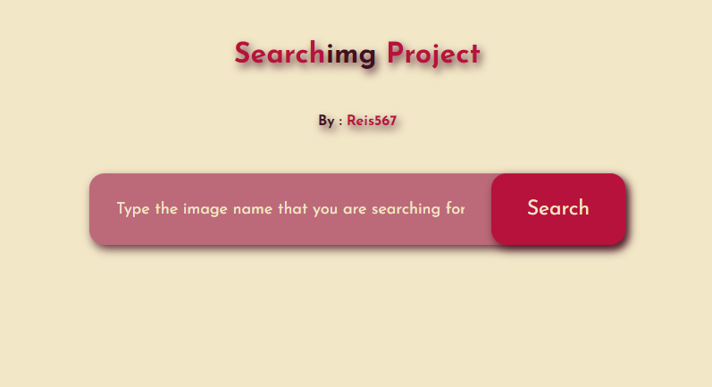

# Image Search App

Portuguese version at the end

This is a simple web application that allows users to search for images using the Unsplash API.

## Features

- Search for images by entering keywords.
- Display search results with clickable image links.
- Paginate through search results.
- Responsive design for different screen sizes.

## Technologies Used

- HTML5
- CSS3
- JavaScript (ES6)
- Unsplash API

## Getting Started

1. Clone the repository: `git clone https://github.com/Reis567/search_img.git`
2. Open `index.html` in your web browser.

## How to Use

1. Enter a search keyword in the search box.
2. Click the "Search" button or press Enter.
3. View the search results.
4. Click the "Show more" button to load more results.

## Code Explanation

- `app.js`: JavaScript code for fetching data from the Unsplash API, handling user interactions, and updating the UI.
- `style.css`: CSS code for styling the application.
- `index.html`: HTML structure of the application.

## Deployment

This project is deployed on Netlify. You can access it at [https://imagesearchreis.netlify.app/](https://imagesearchreis.netlify.app/).

## Creator

This project was created by [Reis567](https://github.com/Reis567).

## GitHub Repository

[https://github.com/Reis567/search_img](https://github.com/Reis567/search_img)

### Português !

# Aplicativo de Busca de Imagens

Este é um aplicativo da web simples que permite aos usuários pesquisar por imagens usando a API do Unsplash.

## Funcionalidades

- Pesquisar por imagens digitando palavras-chave.
- Exibir resultados da pesquisa com links de imagens clicáveis.
- Paginar através dos resultados da pesquisa.
- Design responsivo para diferentes tamanhos de tela.

## Tecnologias Utilizadas

- HTML5
- CSS3
- JavaScript (ES6)
- API do Unsplash

## Começando

1. Clone o repositório: `git clone https://github.com/Reis567/search_img.git`
2. Abra `index.html` em seu navegador da web.

## Como Usar

1. Digite uma palavra-chave de pesquisa na caixa de pesquisa.
2. Clique no botão "Pesquisar" ou pressione Enter.
3. Visualize os resultados da pesquisa.
4. Clique no botão "Mostrar mais" para carregar mais resultados.

## Explicação do Código

- `app.js`: Código JavaScript para obter dados da API do Unsplash, lidar com interações do usuário e atualizar a interface do usuário.
- `style.css`: Código CSS para estilizar o aplicativo.
- `index.html`: Estrutura HTML do aplicativo.

## Implantação

Este projeto está implantado no Netlify. Você pode acessá-lo em [https://imagesearchreis.netlify.app/](https://imagesearchreis.netlify.app/).

## Criador

Este projeto foi criado por [Reis567](https://github.com/Reis567).

## Repositório do GitHub

[https://github.com/Reis567/search_img](https://github.com/Reis567/search_img)

Certifique-se de substituir as URLs, descrições e informações específicas do seu projeto nas respectivas seções do README. Isso deve fornecer aos colaboradores e usuários uma compreensão clara do seu projeto e como usá-lo.